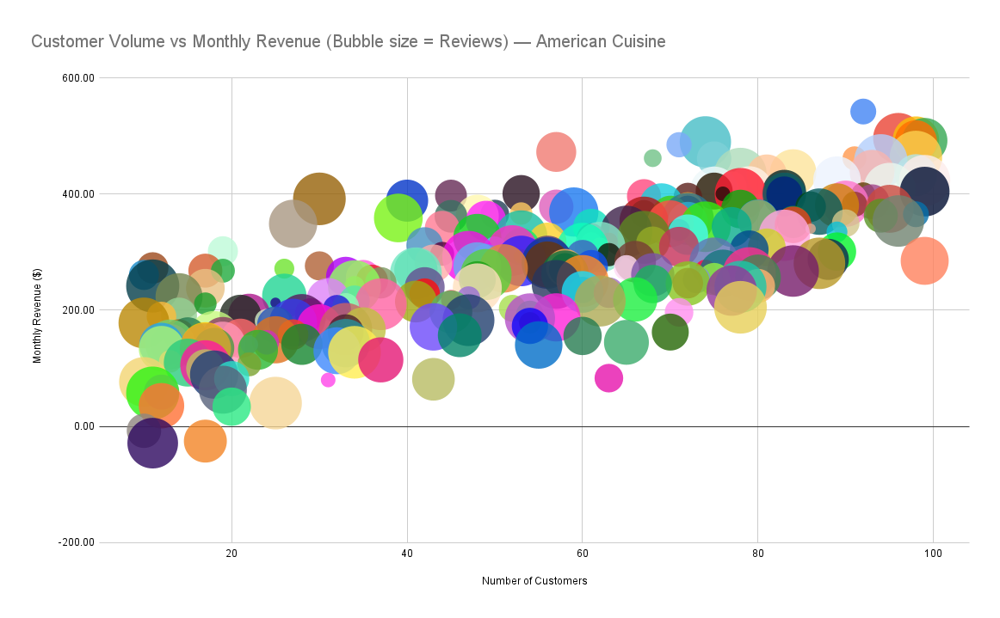
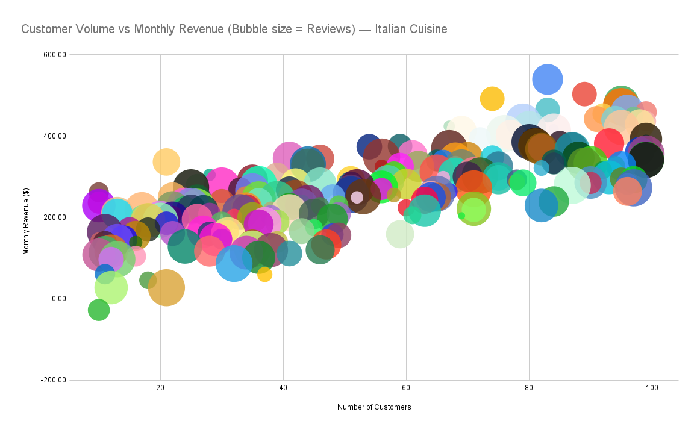
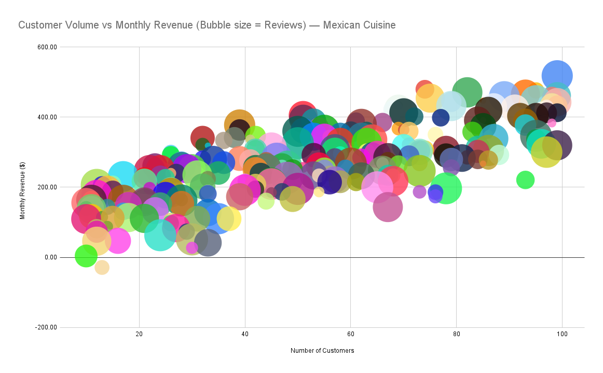

# 🍽️ Restaurant Revenue Analysis by Cuisine Type  

## 🎯 Objective  
Analyze how customer volume and online engagement (reviews) relate to restaurant revenue across different cuisine types.  

---

## 📊 Dataset  
The dataset includes the following columns:  
`Number_of_Customers`, `Menu_Price`, `Marketing_Spend`, `Cuisine_Type`, `Average_Customer_Spending`, `Promotions`, `Reviews`, `Monthly_Revenue`  

- **Monthly_Revenue** includes some negative values, representing months with losses.  
- **Cuisine_Type** includes four categories: American, Italian, Japanese, and Mexican.  

---

## 📈 Visualizations  

### 1. **Average Monthly Revenue by Cuisine Type**  
  

> Japanese cuisine shows the highest average monthly revenue among all categories, though differences remain relatively small.

---

### 2. **Customer Volume vs Revenue — Bubble Charts by Cuisine Type**  

Each chart visualizes the relationship between **number of customers (x-axis)**, **monthly revenue (y-axis)**,  
and **number of reviews (bubble size)** for a single cuisine category.

#### American Cuisine  
  
Customer volume and revenue show a positive trend, while review counts do not appear to significantly affect sales.  

#### Italian Cuisine  
  
Similar to American cuisine, higher customer numbers generally correspond with higher revenue.  

#### Japanese Cuisine  
  
Revenue increases steadily with customer volume, but review counts remain relatively uniform.  

#### Mexican Cuisine  
  
Customer and revenue correlation remains positive, though online review activity does not strongly reflect sales performance.  

---

## 💡 Insights  

- There is a clear **positive correlation** between the number of customers and monthly revenue across all cuisine types.  
- **Review count** does **not show a strong relationship** with revenue or customer volume.  
- This suggests that **online engagement (reviews)** does not necessarily translate into higher sales.  
- Overall, **customer volume** remains the most reliable predictor of restaurant performance in this dataset.  

---

## 🛠️ Tools Used  
- **Google Sheets** (Pivot Tables + Bubble Charts)  
- **GitHub** (Version control & portfolio publishing)

---

## 🚀 Next Steps  
- Add new variables such as `Rating` or `Location` to explore additional patterns.  
- Apply correlation or regression analysis to quantify relationships.  
- Build an interactive dashboard using Looker Studio or Tableau.
