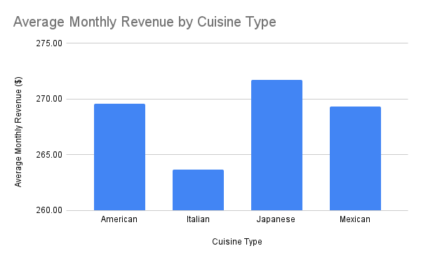

# 🍽️ Restaurant Sales & Marketing Analysis  

## 🎯 Objective  
Analyze how cuisine type and marketing intensity influence restaurant revenue.  

## 📊 Dataset  
The dataset includes the following columns:  
`Number_of_Customers`, `Menu_Price`, `Marketing_Spend`, `Cuisine_Type`, `Average_Customer_Spending`, `Promotions`, `Reviews`, `Monthly_Revenue`  

- **Marketing_Spend** represents a marketing intensity score (from 0 to ~20).  
- **Monthly_Revenue** includes negative values, representing months of loss.  

## 📈 Visualizations   
1. **Average Monthly Revenue by Cuisine Type**
     
3. **Marketing Spend vs Monthly Revenue** (Scatter Plot with Trendline)  

## 💡 Insights  
- Japanese cuisine shows slightly higher average revenue (~271).  
- Higher marketing intensity correlates with higher revenue.  
- Cuisine type alone is not a strong predictor of revenue variance.  

## 🛠️ Tools Used  
Google Sheets (Pivot Tables + Charts), GitHub  

## 🚀 Next Steps  
- Add chart images (pivot_chart.png, scatter_chart.png)  
- Apply regression model to predict revenue  
- Build dashboard in Looker Studio or Tableau
